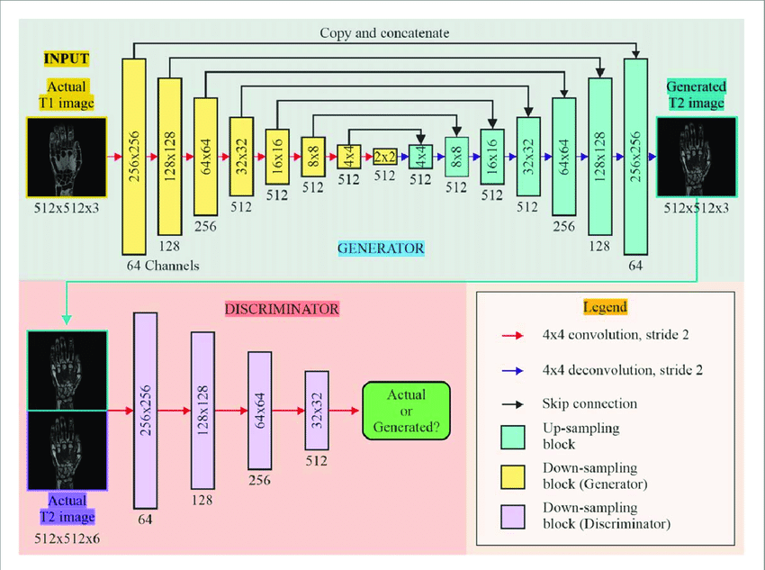

# Pix2Pix

Pix2pix [1] is a conditional Generative Adversarial Network (cGAN) architecture [2] designed for image-to-image translation tasks.  
It leverages a dual network structure, comprising a **generator** and a **discriminator**, engaged in an adversarial training process to achieve precise and realistic image transformations.

The **generator** network synthesizes an output image conditioned on a given input image.
This network typically employs a U-Net [3] architecture (see top image in the Figure below) because this is a design particularly effective for image-to-image translation due to its ability to capture both high-level and low-level features, facilitating the preservation of structural integrity and fine-grained details during the transformation.

The **discriminator** network, conversely, is tasked with distinguishing between genuine image pairs (comprising a real input and its corresponding real output) and synthetic pairs (consisting of the input image and an output generated by the generator). 
Often, a PatchGAN [4] discriminator is utilized, which classifies image patches as real or fake, offering computational advantages and contributing to the generation of sharper and more detailed imagery.

The training process involves a simultaneous optimization of both networks.  The generator is trained to produce increasingly realistic outputs that can "fool" the discriminator, while the discriminator is trained to accurately identify the generated images.  This adversarial dynamic drives the generator to learn the underlying mapping function between the input and output image domains.

## References
[1] Henry, Joyce, Terry Natalie, and Den Madsen. "Pix2pix gan for image-to-image translation." Research Gate Publication (2021): 1-5.
[2] Mirza, Mehdi. "Conditional generative adversarial nets." arXiv preprint arXiv:1411.1784 (2014).
[3] Weng, W. and INet, X.Z., 2021. Convolutional networks for biomedical image segmentation., 2021, 9. DOI: https://doi. org/10.1109/ACCESS, pp.16591-16603.
[4] Isola, Phillip, Jun-Yan Zhu, Tinghui Zhou, and Alexei A. Efros. "Image-to-image translation with conditional adversarial networks." In Proceedings of the IEEE conference on computer vision and pattern recognition, pp. 1125-1134. 2017.